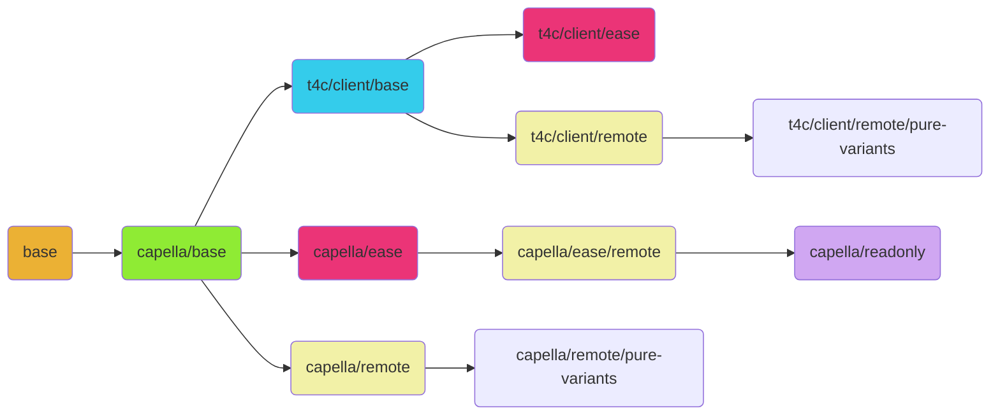

<!--
SPDX-FileCopyrightText: Copyright DB Netz AG and the capella-collab-manager contributors
SPDX-License-Identifier: Apache-2.0
-->

# Capella, T4C Client and EASE Docker images

[](https://api.reuse.software/info/github.com/DSD-DBS/capella-dockerimages)

## Introduction

Please read the **complete** README carefully first, as some requirements must be met
for the containers to work as desired.

The repository provides Docker images for the followings tools:

- [Capella](https://www.eclipse.org/capella/)
- [TeamForCapella client](https://www.obeosoft.com/en/team-for-capella) \
  Right now, we don't provide a Docker image for the server.
- [EASE](https://www.eclipse.org/ease/) \
  [SWT-Bot](https://www.eclipse.org/swtbot/)

This repository includes Docker files to build the following Docker images:

<!-- prettier-ignore -->
| Name of the Docker image | Short description |
|------|---|
| `base` |This is the base image that has the most important tools pre-installed.|
| `capella/base`|This is the Capella base image. It is a simple container with Capella and the required dependencies installed. No more.|
| `t4c/client/base`|This extends the Capella base image with the T4C client and the dependencies.|
| `capella/ease`<br>`t4c/client/ease`|This extends the Capella or T4C client base image with EASE and SWTBot functionality. You can mount every Python script and execute it in a container environment. |
| `capella/remote`<br>`t4c/client/remote`|The remote image will add an RDP server on top of any other image. This will provide the user the possibility to connect and work inside the container.|
| `capella/readonly`|This image has capability to clone a Git repository, will load the project into the workspace and also offers RDP.|
| `t4c/client/backup`|This extends the T4C client base image to import a model from T4C and export it to Git.|
| `t4c/client/exporter`|This extends the T4C client base image to import a model from GIT and export it to T4C.|
| `capella/remote/pure-variants`<br>`t4c/client/remote/pure-variants`|This extends the remote image with pure::variants support.|

Important for building the Docker images is to strictly follow the sequence.
The dependency graph for the images looks like:



### Use our CI templates

Our CI templates are work in progress. You can find the list of supported instances here:
[CI templates README](./ci-templates/README.md)

## Build the images

Please clone this repository and include all submodules:

```zsh
git clone --recurse-submodules https://github.com/DSD-DBS/capella-dockerimages.git
```

**Make sure that all commands are executed in the root directory of the repository.**

> :information_source: When running the build targets with `PUSH_IMAGES=1`, they get pushed to your preferred registry after each build.

### Quick Start

The Quick Start can only be used if the following conditions are met:

- Only the standard configuration is required.
- All files are already in the right place.

If the conditions are not fulfilled, please continue with the next step.

Otherwise, you can simply run the following command to build all images:

```sh
make all
```

### 1. Docker image `base`

Our base image updates the packages and installs the following packages:

- `python3`
- `python3-pip`

Also, we create a custom user `techuser`. This user will always be used to run the
containers and allows to assign a custom `UID`. This can make sense, if you want to
deploy the containers in a K8s cluster and your company has some security restrictions
(e.g. specific `UID` ranges).

Feel free to modify this image to your specific needs. You are able to set proxies,
custom registry URLs, your timezone, CA certificates and any other stuff.

To build the base image, please run:

```zsh
docker build -t base base
```

**Important:**
If your company has a specific base image with all company configurations, of course,
it can also be used:

```zsh
docker build -t base --build-arg BASE_IMAGE=$CUSTOM_IMAGE base
```

Make sure that your `$CUSTOM_IMAGE` is a Linux image that has the common tools installed
and uses the `apt` / `apt-get` package manager. If this is not the case, the image
cannot be used. Our images were tested with the image `debian:bullseye`.

If you like to set a custom `UID` for the user `techuser`, you can run:

```zsh
docker build -t base --build-arg UID=1001 base
```

### 2. Docker image `capella/base`

The Capella base image installs a selected Capella client version. The Capella client can be downloaded and can optionally be customised prior to building the Docker
image or can be downloaded automatically in the Docker image.

#### Option 1: Download Capella archive manually

Download a Capella Linux binary `zip` or `tar.gz` archive. You can get a release
directly from Eclipse. Visit <https://github.com/eclipse/capella/releases>, select a
version and follow the hyperlink labelled `Product` to find a binary release for Linux.

Place the downloaded archive in the subdirectory `capella/versions/$CAPELLA_VERSION` of the present
repository and ensure that the end result is either

- `capella/versions/$CAPELLA_VERSION/capella.tar.gz` or
- `capella/versions/$CAPELLA_VERSION/capella.zip`.

Check that the archive has a structure similar to the following coming with a top level
directory named `capella` and several sub directories and files in it.

For Capella 5.0.0 the structure is illustrated below:

```zsh
$ tree -L 1 capella
capella
├── artifacts.xml
├── capella
├── capella.ini
├── configuration
├── dropins
├── epl-v10.html
├── features
├── jre
├── notice.html
├── p2
├── plugins
└── readme
```

#### Optional: customisation of the Capella client

To customise the Capella client you can

1. extract the downloaded archive,
1. apply any modifications (e. g. installation of plugins and/ or dropins) to it, and
1. compress the modified folder `capella` to get a `capella.zip` or `capella.tar.gz`

again.

#### Workaround of pinned library versions to remove incompatibilities

**Note:** \
_This workaround is normally handled in the [Dockerfile](capella/Dockerfile) and it is
only necessary to download below libraries if there are restrictions on your network
that block an access to these libraries when the Docker image is being built._

In some Capella versions, there are incompatiblities with certain versions of the
following libraries:

- `libjavascriptcoregtk-4.0-18` (version `2.32.4`)
- `libwebkit2gtk-4.0-37` (version `2.32.4`)

The workaround is to use version `2.28.1` for both libraries in the container.

So if your build environment restricts access to the latest versions you need to
manually download the packages with the command `apt download` and inject them into the
container.

For more information refer to [Download older packages manually](#download-older-packages-manually).

#### Build the Docker image

If you skipped the previous workaround, execute the following command:

```zsh
docker build -t capella/base --build-arg CAPELLA_VERSION=$CAPELLA_VERSION capella
```

If you applied the previous workaround and manually downloaded the older libraries, use
the following command:

```zsh
docker build -t capella/base --build-arg CAPELLA_VERSION=$CAPELLA_VERSION --build-arg INJECT_PACKAGES=true capella
```

#### Option 2: Download Capella archive automatically

If you choose to download Capella automatically, then all you have to do is run the following command:

```zsh
docker build -t capella/base capella --build-arg BUILD_TYPE=online --build-arg CAPELLA_VERSION=$CAPELLA_VERSION
```

where `$CAPELLA_VERSION` should be replaced with the Capella version (e.g. `5.2.0`).
If a suitable version is found, it will be downloaded.

### 3. Docker image `t4c/client/base`

The T4C base image builds on top of the Capella base image and installs the T4C client
plugins.

1. Download a Team for Capella client for Linux from
   <https://www.obeosoft.com/en/team-for-capella-download>

   Note that the T4C client version must match the version for Capella itself.
   To obtain a Linux T4C client version below 5.2 you may want to contact
   [Obeo](https://www.obeosoft.com/en/team-for-capella-download) to get a bundle.

1. Extract the downloaded archive. The extracted folder comes with a `.zip` file
   containing the T4C client:

   ```text
   $ tree -L 2 TeamForCapella-5.0.0-linux.gtk.x86_64
   TeamForCapella-5.0.0-linux.gtk.x86_64
   ├── (...)
   └── updateSite
       └── com.thalesgroup.mde.melody.team.license.update-5.0.0-202012091024.zip
   ```

1. That `.zip` file needs to be copied into the subdirectory `t4c/updateSite/$CAPELLA_VERSION`
   of the present repository.

1. Build the container:

   ```zsh
   docker build -t t4c/client/base --build-arg CAPELLA_VERSION=$CAPELLA_VERSION t4c
   ```

#### Feature Patches

It is possible to provide feature patches for our t4c base image that are installed
after the initial installation. To install such feature patches, you have to do the
following things.

1. The feature patch `.zip` file needs to be copied into the subdirectory `t4c/updateSite/$CAPELLA_VERSION`
   of the present repository
1. You have to create the `patch_info.csv` file inside the same subdirectory if not yet existing
1. You have to add a new line to the `patch_info.csv` having the following format:

   ```csv
   <feature patch zip file>,<install iu>,<tag>
   ```

   In case that you have one feature patch zip containing different things you want to
   install you can provide multiple _install iu_, each with a whitespace seperated.
   So in this case the `patch_info.csv` would contain a line with the following format:

   ```csv
   <feature patch zip file>,<install iu 1> <install iu 2> ... <install iu n>,<tag>
   ```

Please ensure that the `patch_info.csv` contains an empty line at the end otherwise
the last feature patch might not be installed.

### 4. Docker images `capella/remote` and `t4c/client/remote`

The remote images allow to extend the

- Capella base image (`capella/base`) or
- the T4C base image (`t4c/client/base`)

with an RDP server, a metrics endpoint to measure the container activity.

It is a basic Linux server with an [Openbox](http://openbox.org/) installation.

Feel free to adjust the configurations `remote/rc.xml` and `remote/menu.xml` to satisfy
custom Openbox configuration needs.

If you like to use your own wallpaper, replace `remote/wallpaper.png`.

In general, no additional configuration is necessary for the build of the remote image:

- Remote image using Capella:

  ```zsh
  docker build -t capella/remote remote --build-arg BASE_IMAGE=capella/base
  ```

- Remote image using T4C Client:

  ```zsh
  docker build -t t4c/client/remote remote --build-arg BASE_IMAGE=t4c/client/base
  ```

### 5. Docker images `capella/ease` and `t4c/client/ease`

The EASE images build on top of the Capella base image or the T4C base image
respectively. They extend the base image with support for Python EASE scripts.
These EASE scripts will run automatically.

If your network is unrestricted, you can build an EASE image with the following command,
whereby you replace `$BASE` with `capella` or `t4c/client`.

```zsh
docker build -t $BASE/ease \
    --build-arg BASE_IMAGE=$BASE/base \
    --build-arg BUILD_TYPE=online \
    ease
```

If your network is restricted, please execute the steps described in
[Download Eclipse Packages manually](#download-eclipse-packages-manually). When your extensions are
located in `ease/extensions` and the right subfolders, please run:

```zsh
docker build -t $BASE/ease \
    --build-arg BASE_IMAGE=$BASE/base \
    --build-arg BUILD_TYPE=offline \
    ease
```

Please replace $BASE with `capella` or `t4c/client`.

### 6. Docker images `capella/cli` and `t4c/client/cli`

The CLI images are meant to have a containerised Capella (with and without a
Team for Capella client) that can be run headless (as command line interface).

Both images build on top of the Capella base image or the T4C base image
respectively. They extend the base image with a virtual display and consider
an entrypoint that forwards all incoming command line flags to the capella
executable.

You can build a CLI image with the following command,
whereby you replace `$BASE` with `capella` or `t4c/client`.

```zsh
docker build -t $BASE/cli --build-arg BASE_IMAGE=$BASE/base cli
```

### 7. Docker image `capella/readonly`

The read-only image builds on top of the Capella EASE remote image and provides support for the read-only use of models.
It clones a git repositories and automatically injects the cloned models in the workspace.

To build the image, please run:

```zsh
docker build -t $BASE/capella/readonly \
    --build-arg BASE_IMAGE=$BASE/capella/ease/remote \
    readonly
```

### 8. Docker image `t4c/client/backup`

The T4C client backup image imports a model from a TeamForCapella server and exports it to a Git repository. It can be used as a backup solution, for example, from a scheduled job.

To build the image, please run:

```zsh
docker build -t t4c/client/backup \
    --build-arg BASE_IMAGE=t4c/client/base \
    backup
```

### 9. Docker image `t4c/client/exporter`

The T4C client exporter image imports a model from a git repository and exports it to a T4C server.

To build the image, please run:

```zsh
docker build -t t4c/client/exporter \
    --build-arg BASE_IMAGE=t4c/client/base \
    exporter
```

### 10. Docker images `capella/remote/pure-variants` and `t4c/client/remote/pure-variants`

This Docker image adds the `pure::variants` Capella plugin and allows the definition of a pure variants license server during runtime.

1. Download the pure::variants updateSite from the pure::variants download site: <https://www.pure-systems.com/pvde-update/> (access restricted, license needed).
   The version on the [public website](https://www.pure-systems.com/pv-update/) is not sufficient (it's missing important plugins).

   Please select: "pure::variants Archived Update Site with all Extensions" for Linux (Tux).

1. Place the zip-file into `pure-variants/updateSite`.
1. If you don't have internet access in your build environment, please go to step 8.1 and continue here afterwards.
1. Start the Docker build:

   ```zsh
   docker build -t t4c/client/remote/pure-variants \
       --build-arg CAPELLA_VERSION=$CAPELLA_VERSION \
       --build-arg
       pure-variants
   ```

#### 10.1 Download pure::variants dependencies

This step is only needed if there is a restricted internet connection in your build environment.

pure::variants needs a subset of the Eclipse 2020-06 repository.
You can find the directory structure here at the bottom of the page: <https://download.eclipse.org/releases/2020-06/202006171000/>

Please download all required files. Your tree should look like:

```text
$ tree pure-variants/dependencies
pure-variants/dependencies
├── artifacts.jar
├── content.jar
└── plugins
    ├── com.google.javascript_0.0.20160315.v20161124-1903.jar
    ├── com.google.protobuf_2.4.0.v201105131100.jar
    ├── org.eclipse.wst.common.core_1.3.0.v201903222010.jar
    ├── org.eclipse.wst.common.environment_1.0.400.v201903222010.jar
    ├── org.eclipse.wst.common.frameworks_1.2.201.v201903222010.jar
    ├── org.eclipse.wst.common.project.facet.core_1.4.400.v201903222010.jar
    ├── org.eclipse.wst.jsdt.core_2.0.303.v202005041016.jar
    ├── org.eclipse.wst.jsdt.manipulation_1.0.601.v201903222047.jar
    ├── org.eclipse.wst.jsdt.ui_2.1.0.v202005221335.jar
    └── org.eclipse.wst.validation_1.2.800.v201904082137.jar
```

## Run the images

### Capella locally on X11 systems

On some systems, you have to whitelist the X-Server with:

```zsh
xhost +local
```

It allows all local programs to connect to your X server. You can further restrict the access to the X server. Please read the [documentation of `xhost`](https://man.archlinux.org/man/xhost.1) for more details.

The container can be started with the following command. The `DISPLAY` environment has to be passed to the container.

```zsh
docker run -d \
    -v /tmp/.X11-unix:/tmp/.X11-unix \
    -e DISPLAY=$(DISPLAY) \
    capella/base
```

Capella should start after a few seconds.

### Capella in a remote container

```zsh
docker run -d \
    -p $RDP_EXTERNAL_PORT:3389 \
    -e RMT_PASSWORD=$RMT_PASSWORD \
    -e AUTOSTART_CAPELLA=$AUTOSTART_CAPELLA \
    -e RESTART_CAPELLA=$RESTART_CAPELLA \
    capella/remote
```

Please replace the followings variables:

- `$RDP_EXTERNAL_PORT` to the external port for RDP on your host (usually `3389`)
- `$RMT_PASSWORD` is the password for remote connections (for the login via RDP) and has
  to be at least 8 characters long.
- `AUTOSTART_CAPELLA` defines the autostart behaviour of Capella. When set to 1 (default), Capella will be started as soon
  as an RDP connection has been established to the running container.
- `RESTART_CAPELLA` defines the restart behaviour of Capella. When set to 1 (default) and when `AUTOSTART_CAPELLA=1`,
  Capella will be re-started as soon as it has been exited (after clean quits as
  well as crashs).

After starting the container, you should be able to connect to
`localhost:$RDP_EXTERNAL_PORT` with your preferred RDP Client.

For the login use the followings credentials:

- **Username**: `techuser`
- **Password**: `$RMT_PASSWORD`

Capella should then start automatically.

### T4C client in a remote container

```zsh
docker run -d \
    -p $RDP_EXTERNAL_PORT:3389 \
    -e T4C_LICENCE_SECRET=XXX \
    -e T4C_JSON='[{"repository": "", "port": 0, "host": "", "instance": "", "protocol": "ssl"}]' \
    -e T4C_SERVER_HOST=$T4C_SERVER_HOST \
    -e T4C_SERVER_PORT=$T4C_SERVER_PORT \
    -e T4C_REPOSITORIES=$T4C_REPOSITORIES \
    -e RMT_PASSWORD=$RMT_PASSWORD \
    -e T4C_USERNAME=$T4C_USERNAME \
    -e AUTOSTART_CAPELLA=$AUTOSTART_CAPELLA \
    -e RESTART_CAPELLA=$RESTART_CAPELLA \
    t4c/client/remote
```

Please replace the followings variables:

- `$RDP_EXTERNAL_PORT` to the external port for RDP on your host (usually `3389`)
- `$RMT_PASSWORD` is the password for remote connections (for the login via RDP).
- `$T4C_LICENCE_SECRET` to your TeamForCapella licence secret.
- `$T4C_USERNAME` is the username that is suggested when connecting to t4c.
- `AUTOSTART_CAPELLA` defines the auto-start behaviour of Capella. When set to 1 (default), Capella will be started as soon
  as an RDP connection has been established to the running container.
- `RESTART_CAPELLA` defines the restart behaviour of Capella. When set to 1 (default) and when `AUTOSTART_CAPELLA=1`,
  Capella will be re-started as soon as it has been exited (after clean quits as
  well as crashs).
- Either `$T4C_JSON` a list of repositories with name, host, port and instance name as a JSON:

  ```json
  [
    {
      "repository": "repoCapella",
      "host": "localhost",
      "port": 2036,
      "instance": "", //optional, required if the repository names are not unique
      "protocol": "ssl" //optional, defaults to ssl
    }
  ]
  ```

  (`$T4C_SERVER_HOST`, `$T4C_SERVER_PORT` and `$T4C_REPOSITORIES` will be ignored.)

- Or (if `$T4C_JSON` is not defined)
  - `$T4C_SERVER_HOST` to the IP-Address of your T4C server (default: `127.0.0.1`).
  - `$T4C_SERVER_PORT` to the port of your T4C server (default: `2036`).
  - `$T4C_REPOSITORIES` is a comma-seperated list of repositories. These repositories show
    up as default options on connection (e.g. `repo1,repo2`).

After starting the container, you should be able to connect to
`localhost:$RDP_EXTERNAL_PORT` with your preferred RDP Client.

Please use the followings credentials:

- **Username**: `techuser`
- **Password**: `$RMT_PASSWORD`

Capella should then start automatically. You should be able to connect to T4C models
out of the box.

The screen size is set every time the connection is established. Depending on your
RDP client, you will also be able to set the preferred screen size in the settings.

By default, Remmina (RDP client for Linux) starts in a tiny window. To fix that, you can
easily set "Use client resolution" instead of "Use initial window size" in the remote
connection profile.

We also plan to integrate "dynamic resizing" in the near future.

### Pure::variants

To run the `pure-variants` images, please follow the instructions to run [`Capella in a remote container`](#capella-in-a-remote-container) or [`T4C client in a remote container`](#t4c-client-in-a-remote-container).

You just have to do some changes:

- Add the environment variable `$PURE_VARIANTS_LICENSE_SERVER` to the `docker run` command. The value is the same as set in the Capella GUI when running a normal installation, e.g. `http://localhost:8080`.
- Replace the image name `$BASE/remote` with `$BASE/remote/pure-variants`
- Bind the directory containing the `license.lic` file to `/inputs/pure-variants/` inside the container.

### EASE container

Run the image with this command and provide EASE Python scripts as a volume.
The scripts have to be located in the `/opt/scripts` directory (inside the container)!

For more information refer to: [How does a EASE Python Script look like?](#how-does-an-ease-python-script-look-like).

To run the container, just execute:

```zsh
docker run -v script.py:/opt/scripts/script.py $BASE/ease
```

where `$BASE` is again `capella` or `t4c/client`.

### CLI container

```zsh
docker run $BASE/cli -nosplash -consolelog -application APPLICATION -appid APPID [...]
```

with `$BASE` being one out of `capella` or `t4c/client`.

**Example to export representations (diagrams) as SVG images:**

Replace `/path/to/model` and `<PROJECT_NAME>` to pass any local Capella
model. Set the project name so that it fits your Capella project name for the
model as it is given in the file `/path/to/model/.project`.

Exported diagrams will appear on the host machine at
`/path/to/model/diagrams`.

```zsh
docker run --rm -it \
  -v /path/to/model:/model \
  capella/cli \
  -nosplash \
  -consolelog \
  -application org.polarsys.capella.core.commandline.core \
  -appid org.polarsys.capella.exportRepresentations \
  -data /workspace \
  -import /model \
  -input "/all" \
  -imageFormat SVG \
  -exportDecorations \
  -outputfolder /<PROJECT_NAME>/diagrams \
  -forceoutputfoldercreation
```

### Read-only container

There are two options available for read-only containers.
The first option supports multiple repositories, but you need to JSON-serizalize it.
With the second option, you can provide the details as environment variables directly.

For both option, you have to replace the used variables:

- `$RDP_EXTERNAL_PORT` with the external port for RDP on your host (usually `3389`)
- `$EASE_LOG_LOCATION` (optional) with the absolute path to log file. Defaults to `/proc/1/fd/1` (Docker logs) if not provided.

#### Option 1: Provide repository details as JSON

With this option, any number of models can be loaded.
These must first be serialized to JSON in the following format:

```json
[
  {
    "url": "https://github.com/DSD-DBS/py-capellambse.git", # Path that is used by 'git clone'
    "revision": "master",
    "depth": 1, # Optional: If depth == 0, the whole history is cloned. Defaults to 0
    "entrypoint": "tests/data/melodymodel/5_2/Melody Model Test.aird", # Path to the aird file, starting from the root of the repository
    "nature": "project", # Optional: Can be either 'project' or 'library'. Defaults to 'project'
    "username": "testuser", # Optional: Only need if repository access is restricted
    "password": "token" # Optional: Only need if repository access is restricted
  }
]
```

The JSON string has to be provided as value to the environment variable with the key `GIT_REPOS_JSON`:

```zsh
docker run -d \
    -p $RDP_EXTERNAL_PORT:3389 \
    -e RMT_PASSWORD=$RMT_PASSWORD \
    -e GIT_REPOS_JSON=$GIT_REPOS_JSON \
    -e EASE_LOG_LOCATION=$EASE_LOG_LOCATION \
    capella/readonly
```

Please replace the `GIT_REPOS_JSON` with the JSON-string (described above).

#### Option 2: Provide repository details directly

With this option, you can only provide details for exactly one repository at time.
If you want to make any number of models available, please use option 1.

```zsh
docker run -d \
    -p $RDP_EXTERNAL_PORT:3389 \
    -e RMT_PASSWORD=$RMT_PASSWORD \
    -e GIT_URL=$GIT_URL \
    -e GIT_ENTRYPOINT=$GIT_ENTRYPOINT \
    -e GIT_REVISION=$GIT_REVISION \
    -e GIT_DEPTH=$GIT_DEPTH \
    -e GIT_USERNAME=$GIT_USERNAME \
    -e GIT_PASSWORD=$GIT_PASSWORD \
    -e EASE_LOG_LOCATION=$EASE_LOG_LOCATION \
    capella/readonly
```

Please replace the followings variables (in addition to the general variables):

- `$GIT_URL` with the URL to the Git repository. All URI-formats supported by the `git clone` command will work. Please do NOT include credentials in the URL as they will be not cleaned after cloning the model. You can provide HTTP credentials via the `GIT_USERNAME` and `GIT_PASSWORD` variables (see below).
- `$GIT_ENTRYPOINT` with the relative path from the root of your repository to the `aird`-file of your model, e.g. `path/to/model.aird`.
- `$GIT_REVISION` with the desired revision of the git repository. The revision is cloned with the `--single-branch` option, therefore only the specific revision is accessible. Only tags and branches are supported, commit hashes are NOT supported. If empty, the whole repository gets cloned.
- `$GIT_DEPTH` with the desired git depth. If not provided, the whole history will be cloned.
- `$GIT_USERNAME` with the git username if the repository is access protected. Leave empty, when no authentication is required.
- `$GIT_PASSWORD` with the git password if the repository is access protected. Leave empty, when no authentication is required. The password gets cleaned after cloning and is not accessible in the RDP connection.

### Backup image

Please run the following command to backup from T4C to Git:

```zsh
docker run -d \
  -e GIT_REPO_URL=https://github.com/example/example.git \
  -e GIT_REPO_BRANCH=main \
  -e GIT_USERNAME=user \
  -e GIT_PASSWORD=password \
  -e T4C_REPO_HOST=localhost \
  -e T4C_REPO_PORT=2036 \
  -e T4C_CDO_PORT=12036 \
  -e T4C_REPO_NAME=repoCapella \
  -e T4C_PROJECT_NAME=test \
  -e T4C_USERNAME=user \
  -e T4C_PASSWORD=password \
  -e LOG_LEVEL="DEBUG" \
  -e INCLUDE_COMMIT_HISTORY=false \
  t4c/client/backup
```

Set the following values for the corresponding keys:

- `GIT_REPO_URL`: URL to the target Git repository where the model will be pushed to. All URI-formats supported by the `git clone` command will work. You can provide HTTP credentials via the `GIT_USERNAME` and `GIT_PASSWORD` variables (see below).
- `GIT_REPO_BRANCH`: branch of the Git repository.
- `GIT_USERNAME`: Git username if the repository is access protected.
- `GIT_PASSWORD`: Git password that is used during cloning from and pushing to the Git repository.
- `T4C_REPO_HOST`: hostname to the T4C server. The same value that you enter in Capella to connect to a remote repository.
- `T4C_REPO_PORT`: port to the T4C server. The same value that you enter in Capella to connect to a remote repository. Defaults to 2036.
- `T4C_CDO_PORT`: CDO port to the T4C server. Defaults to 12036.
- `T4C_REPO_NAME`: T4C repository name. The same value that you enter in Capella to connect to a remote repository.
- `T4C_PROJECT_NAME`: name of the Capella project. It's displayed in the Capella project explorer and in the last step when connecting to a remote repository.
- `T4C_USERNAME`: T4C username that is used during the import. The user needs to have access to the repository.
- `T4C_PASSWORD`: T4C password that is used during the import.
- `LOG_LEVEL`: your preferred logging level (all Python logging levels are supported).
- `INCLUDE_COMMIT_HISTORY`: `true` or `false` to define if the T4C commit history should be exported. Important: Exporting the commit history can take a few hours for large models.

### Exporter image

Please run the following command to export from Git to T4C:

```zsh
docker run -d \
  -e GIT_REPO_URL=https://github.com/example/example.git \
  -e GIT_REPO_BRANCH=main \
  -e GIT_USERNAME=user \
  -e GIT_PASSWORD=password \
  -e T4C_REPO_HOST=localhost \
  -e T4C_REPO_PORT=2036 \
  -e T4C_REPO_NAME=repoCapella \
  -e T4C_PROJECT_NAME=test \
  -e T4C_USERNAME=user \
  -e T4C_PASSWORD=password \
  -e HTTP_PORT=8080 \
  -e HTTP_LOGIN=admin \
  -e HTTP_PASSWORD=password \
  -e LOG_LEVEL=DEBUG \
  t4c/client/exporter
```

You can find the description for most of the values directly above and here are the additional ones:

- `HTTP_PORT`: port to the T4C http server
- `HTTP_LOGIN`: username for the REST API. At the moment administrator access is required
- `HTTP_PASSWORD`: password for the REST API

## Additional notes

### Tips

- You can mount a Capella workspace inside the container by appending the follwing to
  the `docker run` command:

  ```zsh
  -v /path/to/your/local/volume:/workspace
  ```

### Dockerfile guidelines

We tried to follow the common recommendations for writing Dockerfiles.

We have explicitly observed the following:

- We use the package manager interface `apt-get`, because `apt` does not have a stable
  CLI interface and is not recommended to use it in scripts.

- We tried to reduce the number of layers and to group commands as much as possible.
  However, in some cases we use caching and in other cases it was not always possible
  to group everything for reasons of clarity.

### Build Capella from source

We provide a script, which runs a Docker container to build Capella from source.
Our builder script adds the aarch64 build platform for macOS and linux.
Please note that Capella itself has no official support for the aarch64 architecture yet.
We can not guarantee that everything works, but all of the official Capella tests passed on the generated archives.

In addition, the builder only works for Capella version 6.0.0 for now.
To start the script, please run:

```
CAPELLA_VERSION=6.0.0 make capella/builder
```

When the script is successful, you should see the result in `builder/output`.

We store a cache of the maven repository in the `builder/m2_cache` directory.
If you don't need the cache anymore, you can delete the directory after building.

### Download older packages manually

Unfortunately the version `2.28.1` of `libwebkit2gtk-4.0-37` is no longer available in
the default Debian `bullyseye-updates` registry, but it is still available in the
Ubuntu `focal` repository (<https://packages.ubuntu.com/focal/libwebkit2gtk-4.0-37>).

First of all, you have to add the source to your `apt`-sources and add the apt keys.

Recommendation: Spawn a Docker container and execute the steps inside the container.

```zsh
echo "deb http://de.archive.ubuntu.com/ubuntu/ focal main"
apt-key adv --keyserver keyserver.ubuntu.com --recv-keys 3B4FE6ACC0B21F32
apt-key adv --keyserver keyserver.ubuntu.com --recv-keys 871920D1991BC93C
apt update
```

Please download all packages and place the files in the folder `capella/libs`:

- `libicu66_66.1-2ubuntu2_amd64.deb` \
  (Run `apt download libicu66=66.1-2ubuntu2`)

- `libjavascriptcoregtk-4.0-18_2.28.1-1_amd64.deb` \
  (Run `apt download libjavascriptcoregtk-4.0-18=2.28.1-1`)

- `libjpeg-turbo8_2.0.3-0ubuntu1_amd64.deb` \
  (Run `apt download libjpeg-turbo8=2.0.3-0ubuntu1`)

- `libjpeg8_8c-2ubuntu8_amd64.deb` \
  (Run `apt download libjpeg8=8c-2ubuntu8`)

- `libwebkit2gtk-4.0-37_2.28.1-1_amd64.deb` \
  (Run `apt download libwebkit2gtk-4.0-37=2.28.1-1`)

### Download Eclipse packages manually

If your network is restricted and doesn't have access to the public Eclipse registries,
you have to manually download and inject the packages. Luckily capella is an
application build within eclipse which offers a command line tool for downloading
resources from eclipse software repositories. Refer to [this wiki article](https://wiki.eclipse.org/Equinox_p2_Repository_Mirroring#Running_the_Mirroring_Tools) if you
are interested to learn the capabilities of the eclipse mirroring tool.

You have to run the following commands for each of these following urls to download the
metadata and artifact for the packages:

- <https://eclipse.py4j.org/>
- <https://download.eclipse.org/ease/integration/nightly/>
- <https://download.eclipse.org/technology/swtbot/releases/latest/>

```zsh
capella -nosplash -verbose
-application org.eclipse.equinox.p2.artifact.repository.mirrorApplication
-source <url>
-destination <destionation_path> (e.g. file:ease/extensions/<extension>)>
```

```zsh
capella -nosplash -verbose
-application org.eclipse.equinox.p2.metadata.repository.mirrorApplication
-source <url>
-destination <destionation_path> (e.g. file:ease/extensions/<extension>)>
```

where `<extension>` is `py4j`, `ease` or `swtbot`. `capellac` is the path to the
capella executable laying in the capella directory (capella.zip/capella/capella).
If you have build an AppImage (linux) or a shortcut for it you can also call this
with the displayed options.

Each directory `ease/extensions/<extension>` should have the following structure:

- `content.jar`
- `artifacts.jar`
- `plugins/`
  - `*.jar` files
- `features/`
  - `*.jar` files

### How does an EASE Python script look like?

In general, you can try to execute the Py4J in the Eclipse environment for development
purposes first. When the script is tested, you can use it in our container.

Please make sure that any EASE Python scripts have the `onStartup` comment in the
header. That can be the first line or the first line after the module docstring.
This is required, otherwise the scripts will not be auto-executed.

```python
# onStartup: 0
```

An example script using our PyEclipseEase library could look like:

```python
# onStartup: 0
import pyease.ease

if __name__ == "__main__":
    logger = ease.logger
    ease.log_to_file(os.environ["EASE_LOG_LOCATION"])

    pyease.ease.open_eclipse_perspective("Capella")
    logger.info("Hello world!")

    pyease.ease.kill_capella_process(30)
```
