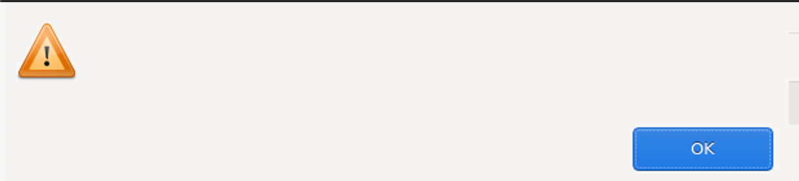

<!--
 ~ SPDX-FileCopyrightText: Copyright DB InfraGO AG and contributors
 ~ SPDX-License-Identifier: Apache-2.0
 -->

# Support for Git Hooks

To support Git hooks, we have decided to utilize the
[pre-commit](https://pre-commit.com/) framework. This framework allows for
automatic fetching and updating of hooks from external sources, providing users
with a high level of flexibility and adaptability. Additionally, it effectively
decouples the development process of Git hooks from our Docker image release
lifecycle.

The implementation was tested with the official Git CLI and JGit/EGit (in
Eclipse).

## Project-Specific Hooks

Project-specific hooks can be defined separately for each Git repository. The
defined Git hooks will not be auto-updated by us. Instead, the responsibility
falls on the repository owners to keep them up-to-date and maintain them.

### Installation

To install Git hooks, add a `.pre-commit-config.yaml` file to the root of your
repository. Simply follow the official pre-commit instructions:
[Add a pre-commit configuration](https://pre-commit.com/#2-add-a-pre-commit-configuration).
Commit the file after making changes. Git will automatically detect it,
eliminating the need to explicitly install the hooks via `pre-commit install`.

<!-- prettier-ignore -->
!!! info
    `pre-commit` is installed for all stages by default. This means that your pre-commit hooks will run at every stage.
    If you want to limit the hooks to specific stages, for example, to run hooks only at the `pre-commit` stage, add the following to your `.pre-commit-config.yaml` file:

    ```yaml
    default_stages: [pre-commit]
    ```

    Alternatively, specify stages for each hook individually:

    ```yaml
    - repo: local
      hooks:
        - id: my-hook
          stages: [pre-commit]
    ```

    For more information, refer to the `pre-commit` documentation: [Confining hooks to run at certain stages](https://pre-commit.com/#confining-hooks-to-run-at-certain-stages).

### Updates

To auto-update Git hooks, update the versions in your repository's
`.pre-commit-config.yaml` file. Refer to the official documentation for
[updating hooks automatically](https://pre-commit.com/#updating-hooks-automatically).

## Technical Background

To facilitate this implementation, we have globally set the `core.hooksPath`
configuration option in Git to `/opt/git/global-hooks`. We initialize the
pre-commit framework in this directory. This ensures that the hook is
registered as `/opt/git/global-hooks/pre-commit`. Since the initialization of
Git hooks with the pre-commit framework can be slow, we maintain a cache of the
pre-commit environment and store it in the persistent `/workspace` directory.

## Troubleshooting

<!-- prettier-ignore -->
!!! warning "Error Message in Eclipse with EGit"
    If you receive an error message in Eclipse (as shown below) while committing, your pre-commit has failed.
    

    Please check the Capella logs, located at `/var/logs`.
