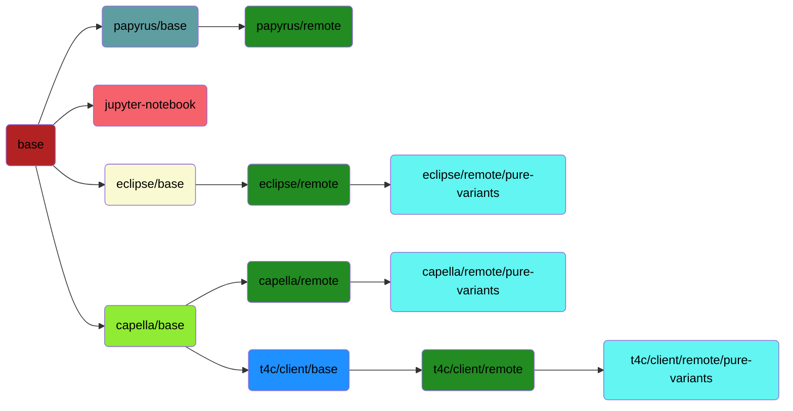

<!--
 ~ SPDX-FileCopyrightText: Copyright DB InfraGO AG and contributors
 ~ SPDX-License-Identifier: Apache-2.0
 -->

# Welcome

Welcome to the MBSE Docker images repository. Initially started for our
[Capella Collaboration Manager](https://github.com/DSD-DBS/capella-collab-manager)
to run Capella in a browser, we now offer a variety of Docker images to
automate processes in the MBSE context.

## Use prebuilt images from Github packages

For license reasons, we are only able to provide the following prebuilt public
images at this time:

- [`base`](base.md)
- [`capella/base`](capella/base.md) (without dropins or plugins)

If you need another image, please follow the
[`Build images locally`](#build-images-locally) or
[`Build images in a CI/CD environment`](#build-images-in-a-cicd-environment)
instructions.

## Build images locally

To get started, please clone this repository and include all submodules:

```zsh
git clone https://github.com/DSD-DBS/capella-dockerimages.git
```

### Build images using our CLI

You can use our command-line interface to build, run and
debug our Docker images.

!!! info

    For each image, please execute the steps described in the preparation section
    in the documentation before building the image.

To install the CLI, install the [uv package manager](https://docs.astral.sh/uv/getting-started/installation/)
and run the following command:


```
uv tool install -e ./cli
```

Then, just run the following command:

```sh
cdi --help
```

### Build images manually with Docker

It's important to strictly follow the sequence. Several Docker images depend on
each other. The full dependency graph for the images looks like:



Each highlighted color indicates the Dockerfile which is used to build the
image:

<!-- prettier-ignore -->
:material-checkbox-blank-circle:{ style="color: #b22222 " } [Base](base.md) <br>
:material-checkbox-blank-circle:{ style="color: #8feb34 " } [Capella Base](capella/base.md)<br>
:material-checkbox-blank-circle:{ style="color: #fafad2 " } [Eclipse Base](eclipse/base.md)<br>
:material-checkbox-blank-circle:{ style="color: #5f9ea0 " } [Papyrus Base](papyrus/base.md)<br>
:material-checkbox-blank-circle:{ style="color: #1e90ff " } [T4C Client Base](capella/t4c/base.md) <br>
:material-checkbox-blank-circle:{ style="color: #228b22 " } [Remote](remote.md) <br>
:material-checkbox-blank-circle:{ style="color: #62f5f2 " } [pure::variants](pure-variants.md) <br>
:material-checkbox-blank-circle:{ style="color: #f5626c " } [Jupyter notebook](jupyter/index.md) <br>

**Make sure that all `docker` commands are executed in the root directory of
the repository.**

For each image, you'll find documentation how to build & run the image
manually.

## Build images in a CI/CD environment

We provide a
[Gitlab CI/CD template](https://github.com/DSD-DBS/capella-dockerimages/blob/main/ci-templates/gitlab/image-builder.yml)
to build the images in CI/CD environment. Please find the instructions
[here](https://github.com/DSD-DBS/capella-dockerimages/tree/main/ci-templates/gitlab#image-builder).
