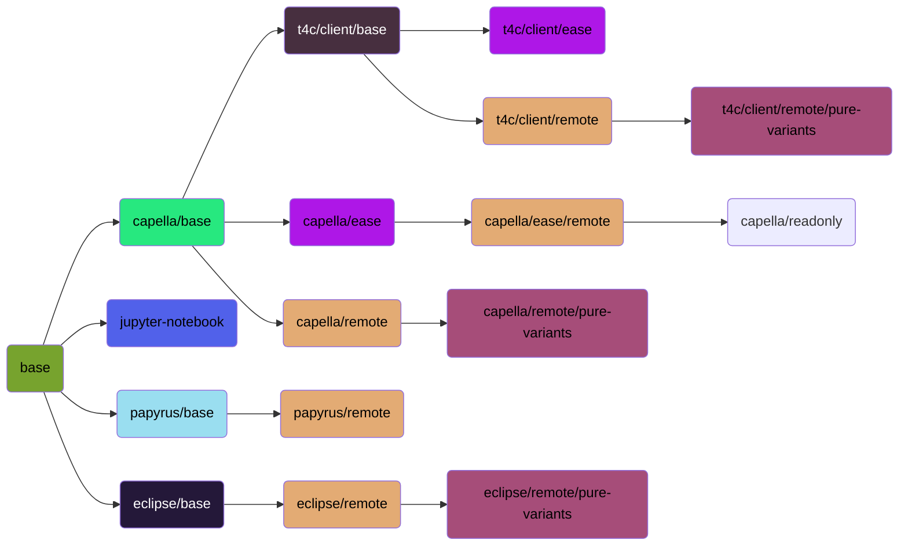

<!--
 ~ SPDX-FileCopyrightText: Copyright DB Netz AG and the capella-collab-manager contributors
 ~ SPDX-License-Identifier: Apache-2.0
 -->

# Welcome

Welcome to the MBSE Docker images repository. Initially started for our [Capella Collaboration Manager](https://github.com/DSD-DBS/capella-collab-manager) to run Capella in a browser, we now offer a variety of Docker images to automate processes in the MBSE context.

## Use prebuilt images from Github packages

For license reasons, we are only able to provide the following prebuilt public images at this time:

- [`base`](base.md)
- [`capella/base`](capella/base.md) (without dropins or plugins)
- [`capella/readonly`](capella/readonly.md)

If you need another image, please follow the [`Build images locally`](#build-images-locally) or [`Build images in a CI/CD environment`](#build-images-in-a-cicd-environment) instructions.

## Build images locally

To get started, please clone this repository and include all submodules:

```zsh
git clone https://github.com/DSD-DBS/capella-dockerimages.git
```

### Build images with GNU Make

If you have [GNU Make](https://www.gnu.org/software/make/manual/make.html) installed on your system, you can make use of our Makefile to build, run and debug our Docker images.

<!-- prettier-ignore -->
!!! warning

    The minimum required GNU Make version is `3.82`, however we recommend version `4.X`. Use version `4.4` for the best experience. The **preinstalled Make version on macOS is `3.81` and is not supported by us**. Please update the version to >= `3.82`.

<!-- prettier-ignore -->
!!! info

    When running the build targets with `PUSH_IMAGES=1`, they get pushed to your preferred registry after each build.

For each image, please execute the steps described in the preparation section in the documentation for each image.

Then, just run the following command:

```sh
make <image-name>
```

to build the image and it's dependencies or

```sh
make run-<image-name>
```

to build the images, all dependencies and run the image.

In case you executed the preparation sections for all images, you can run:

```sh
make all
```

### Build images manually with Docker

It's important to strictly follow the sequence. Several Docker images depend on each other.
The full dependency graph for the images looks like:



Each highlighted color indicates the Dockerfile which is used to build the image:

:material-checkbox-blank-circle:{ style="color: #ebb134 " } [Base](base.md) <br>
:material-checkbox-blank-circle:{ style="color: #8feb34 " } [Capella Base](capella/base.md)<br>
:material-checkbox-blank-circle:{ style="color: #34cceb " } [T4C Client Base](capella/t4c/base.md) <br>
:material-checkbox-blank-circle:{ style="color: #eb3477 " } [EASE](ease.md) <br>
:material-checkbox-blank-circle:{ style="color: #f2f1a7 " } [Remote](remote.md) <br>
:material-checkbox-blank-circle:{ style="color: #d0a7f2 " } [Capella read-only](capella/readonly.md) <br>
:material-checkbox-blank-circle:{ style="color: #62f5f2 " } [pure::variants](pure-variants.md) <br>
:material-checkbox-blank-circle:{ style="color: #f5626c " } [Jupyter notebook](jupyter/index.md) <br>

**Make sure that all `docker` commands are executed in the root directory of the repository.**

For each image, you'll find documentation how to build & run the image manually.

## Build images in a CI/CD environment

We provide a [Gitlab CI/CD template](https://github.com/DSD-DBS/capella-dockerimages/blob/main/ci-templates/gitlab/image-builder.yml) to build and test the images in CI/CD environment.
Please find the instructions [here](https://github.com/DSD-DBS/capella-dockerimages/tree/main/ci-templates/gitlab#image-builder).
